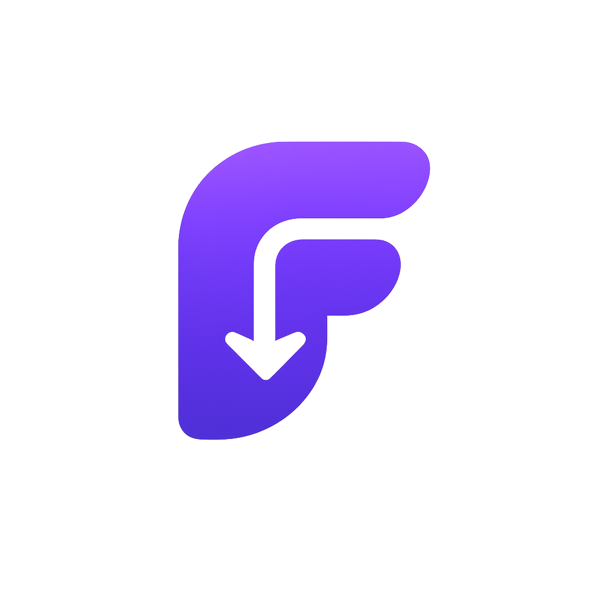

<div align="center">

  

  # ⚡ FETCH
  ### *Download Anything, Anywhere, Anytime.*

  [](https://nextjs.org/)
  [](https://react.dev/)
  [](https://nodejs.org/)
  [](LICENSE)
  [](#)

  <p align="center">
    A high-performance, privacy-focused media extraction & downloading platform.<br />
    Download videos, audio, and multi-photo galleries in maximum original quality — with zero ads and zero sign-ups.
  </p>

  ---

</div>

<br />

## 🌟 Key Features

| Feature | Description |
| :--- | :--- |
| ⚡ **Instant Link Parsing** | Asynchronously extracts video metadata, thumbnails, formats, and high-res media streams. |
| 🎥 **Max-Quality Video Export** | Supports 1080p, 2K, and 4K video downloads powered by `yt-dlp` and `ffmpeg`. |
| 📸 **Multi-Photo ZIP Export** | Interactive photo gallery carousel with single-click batch ZIP downloading for multi-image posts. |
| 🛡️ **Zero Ads & Privacy-First** | No telemetry, no redirect ads, no popups, and no account creation required. |
| 🎨 **Industrial Glass Aesthetic** | Crafted with double-bezel glassmorphism, responsive ambient spotlights, and dark mode UI. |
| 🔄 **Hydration-Safe Image Proxy** | Built-in proxy streaming server (`/api/proxy-image`) bypassing CORS and referrer blocks seamlessly. |

<br />

## 🌐 Supported Platforms & Matrix

Fetch supports media extraction across major video and social networking platforms:

| Platform | Video | Audio (MP3) | Multi-Photo Gallery | Original Resolution |
| :--- | :---: | :---: | :---: | :---: |
| **YouTube** | ✅ | ✅ | N/A | Up to 4K / 60fps |
| **Facebook** | ✅ | ✅ | ✅ | Full HD |
| **Instagram** | ✅ | ✅ | ✅ (Carousel ZIP) | High-Res JPG |
| **X (Twitter)** | ✅ | ✅ | ✅ | Full Quality |
| **TikTok** | ✅ | ✅ | N/A | Watermark-Free |
| **Pinterest** | ✅ | ❌ | ✅ | HD Pin Images |

<br />

## 🛠️ Tech Stack & Architecture

- **Frontend Core**: [Next.js 15 (App Router)](https://nextjs.org/), React 19
- **Styling & Motion**: Custom Vanilla CSS Tokens (`globals.css`), HSL Design Tokens, Micro-Animations
- **Iconography**: [Lucide React](https://lucide.react.dev/)
- **Backend API**: Next.js Serverless Route Handlers (`/api/extract`, `/api/download`, `/api/proxy-image`)
- **Extraction Engine**: [yt-dlp](https://github.com/yt-dlp/yt-dlp) & `@ffmpeg-installer/ffmpeg`
- **Archive Engine**: `JSZip` / Node.js Streaming Pipelines

```
fetch-downloader/
├── src/
│   ├── app/
│   │   ├── api/
│   │   │   ├── download/route.js     # Media download & ffmpeg stream handler
│   │   │   ├── extract/route.js      # URL parsing & metadata extraction API
│   │   │   ├── health/route.js       # System health & yt-dlp binary status
│   │   │   └── proxy-image/route.js  # CORS & image proxy stream handler
│   │   ├── page.js                   # Main landing page (Hero, Input, Preview, Features)
│   │   ├── globals.css               # Design system tokens, glass utilities, animations
│   │   └── layout.js                 # App root layout & spotlight background provider
│   ├── components/
│   │   ├── Header/                   # Fixed frosted glass navigation header
│   │   ├── UrlInput/                 # Smart URL input bar with paste & auto-detect
│   │   ├── PlatformBadges/           # Interactive sample quick-select platform pills
│   │   ├── PreviewCard/              # Extracted media preview, format selector, carousel
│   │   ├── SpotlightCard/            # Hover spotlight effect wrapper
│   │   └── Footer/                   # Minimalist brand footer
│   └── lib/
│       └── ytdlp.js                  # yt-dlp wrapper & media stream parser
└── openspec/                         # Spec-driven development change specs
```

<br />

## 🚀 Getting Started

### Prerequisites

Ensure you have the following installed on your machine:
- **Node.js**: `v20.0.0` or higher
- **npm** or **pnpm** / **yarn**
- **Python 3.x** (optional, recommended for standalone `yt-dlp` fallback execution)

### 1. Clone the Repository

```bash
git clone https://github.com/carylatienza/fetch-downloader.git
cd fetch-downloader
```

### 2. Install Dependencies

```bash
npm install
```

### 3. Run Development Server

```bash
npm run dev
```

Open [http://localhost:3000](http://localhost:3000) in your browser to view the application.

### 4. Build for Production

```bash
npm run build
npm run start
```

<br />

## 📡 API Reference Overview

### `POST /api/extract`
Parses a target URL and returns extracted media metadata.

**Request Body:**
```json
{
  "url": "https://www.youtube.com/watch?v=EXAMPLE"
}
```

**Response:**
```json
{
  "title": "Sample Media Title",
  "thumbnail": "/api/proxy-image?url=...",
  "duration": "03:45",
  "platform": "youtube",
  "formats": [
    { "formatId": "1080p", "ext": "mp4", "quality": "1080p HD" },
    { "formatId": "audio", "ext": "mp3", "quality": "Audio Only" }
  ]
}
```

---

### `GET /api/download`
Streams the selected video/audio quality stream directly to the client with `Content-Disposition` attachment header.

**Query Parameters:**
- `url`: Target media URL
- `formatId`: Desired format string (e.g. `bestvideo+bestaudio/best`)
- `title`: Filename for attachment

<br />

## 📄 License

Distributed under the **MIT License**. See `LICENSE` for details.

---

<div align="center">
  <sub>Built with ❤️ using Next.js & OpenSpec</sub>
</div>
